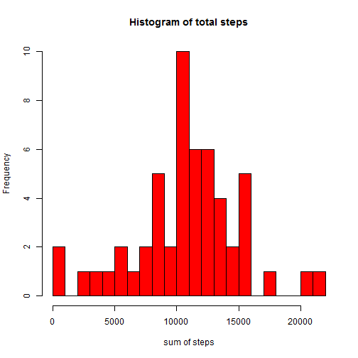
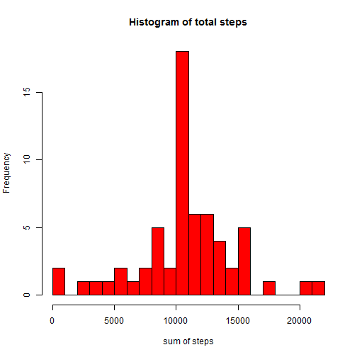

Reproducible Research Assignment1
========================================================

This is R markdown file for assignment 1 of reproducible research.
First, you should download and unzip the source file.

Then you can read the data into a table and you can read some information from the summary.


```r
data <- read.csv("activity.csv")
summary(data)
```

```
##      steps               date          interval   
##  Min.   :  0.0   2012-10-01:  288   Min.   :   0  
##  1st Qu.:  0.0   2012-10-02:  288   1st Qu.: 589  
##  Median :  0.0   2012-10-03:  288   Median :1178  
##  Mean   : 37.4   2012-10-04:  288   Mean   :1178  
##  3rd Qu.: 12.0   2012-10-05:  288   3rd Qu.:1766  
##  Max.   :806.0   2012-10-06:  288   Max.   :2355  
##  NA's   :2304    (Other)   :15840
```


Up to now, you have finished the first step of the assignment. Now let's turn to the second step.

First, let's calculate the total steps by date and plot a histogram. You can change the label and color of this plot as you want.


```r
sum <- tapply(data$steps, data$date, sum)
hist(sum, breaks = 20, col = "red", xlab = "sum of steps", main = "Histogram of total steps")
```

 


Note that you do not need to use the option "na.rm=TRUE" is kickout missing value at this point or otherwise you will see some value of total steps equal to 0. On the other side, you do need that option while calculating the mean and median values.

Next, let's calculate the mean and median of the total steps:


```r
mean(sum, na.rm = TRUE)
```

```
## [1] 10766
```


```r
median(sum, na.rm = TRUE)
```

```
## [1] 10765
```


Great, we have finished the step 2. Now let's move on to the step 3.

Let's first calculate the average steps by 5 minutes interval using the aggregation of the data by "interval" parameter (hour and minute of the day):


```r
aggdata <- aggregate(data$step, by = list(data$interval), FUN = mean, na.rm = TRUE)
names(aggdata) = c("interval", "average_steps")
```


Then we can make the line plot. Again, you can make you preference of label and color by changing the parameter.


```r
plot(aggdata$interval, aggdata$average_steps, type = "l", xlab = "interval", 
    ylab = "average steps")
```

 


The rest of the step 3 is to calculate at which interval we can observe the maximum average steps


```r
aggdata$interval[which.max(aggdata$average_steps)]
```

```
## [1] 835
```

The result's means the number of steps has a maximum value from 835 to 840.

That's step 3. The first job of step 4 is to calculate the number of missing value of steps (NA).


```r
sum(is.na(data$steps))
```

```
## [1] 2304
```


Next, we will find a strategy for imputting all of the missing values. Here, I will use the mean value for the specific 5 minutes data (Which is just what we calculated before). First, copy the data to a new data set and then imputing the missing values in new dataset.


```r
dataimp <- data
for (i in 1:dim(data)[1]) {
    if (is.na(data[i, ]$steps)) {
        dataimp[i, ]$steps = aggdata$average_steps[which(aggdata$interval == 
            dataimp[i, ]$interval)]
    }
}
```


Now let's revisit the mean and median value of total steps by day in the original dataset.


```r
mean(sum, na.rm = TRUE)
```

```
## [1] 10766
```

```r
median(sum, na.rm = TRUE)
```

```
## [1] 10765
```


Then, we can make a histogram of the new dataset and calculate the mean and median value of total steps by day in the new dataset.


```r
sumimp <- tapply(dataimp$steps, dataimp$date, sum)
hist(sumimp, breaks = 20, col = "red", xlab = "sum of steps", main = "Histogram of total steps")
```

 

```r
mean(sumimp, na.rm = TRUE)
```

```
## [1] 10766
```

```r
median(sumimp, na.rm = TRUE)
```

```
## [1] 10766
```

Since, we use the average data of 5-minute interval for calculating the missing value throughout a day, then the total steps of of this day is expected to be the same value as mean of total steps, which implies the mean value of the new dataset will not change. On the other side, since, since the median value is not exactly equal to the mean value in the old dataset, we do see a change of median value in the new dataset due to addition of several values of "10766" (higher middle bar at value of 10000 in the histogram).

Finally the step 5.

You can strip the date of the data from "date" column, and combine it with original data (we will use it in step 5):


```r
time <- strptime(dataimp$date, "%Y-%m-%d")
dataimp <- cbind(dataimp, time)
```

By doing this, you can get the date of the activity and then use weekdays() function to separate weekdays and weekends.


```r
weekends <- weekdays(dataimp$time) == "Sunday" | weekdays(dataimp$time) == "Saturday"
names(weekends) <- weekends
dataimp <- cbind(dataimp, weekends)
```

The next step is to split the weekdays and weekend data.

```r
tempimp <- split(dataimp, dataimp$weekends)
ave_weekdays <- aggregate(tempimp[[1]]$step, by = list(tempimp[[1]]$interval), 
    FUN = mean)
ave_weekends <- aggregate(tempimp[[2]]$step, by = list(tempimp[[2]]$interval), 
    FUN = mean)
names(ave_weekdays) = c("interval", "average_steps")
names(ave_weekends) = c("interval", "average_steps")
```


We can calculate the sum of steps in weekday and weekends to see if there is difference.


```r
sum(ave_weekdays$average_steps)
```

```
## [1] 10256
```

```r
sum(ave_weekends$average_steps)
```

```
## [1] 12202
```

We can see that the total steps in weekends are larger than in weekdays.

Finally, combine data and do panel plot using lattice graphics.


```r
library(lattice)
ave_weekdays$weekday = "weekday"
ave_weekends$weekday = "weekend"
ave <- rbind(ave_weekdays, ave_weekends)
xyplot(average_steps ~ interval | weekday, data = ave, layout = c(1, 2), type = "l", 
    ylab = "Number of steps")
```

 


You can find that the steps made in the afternoon are more in weekends than in weekends.
